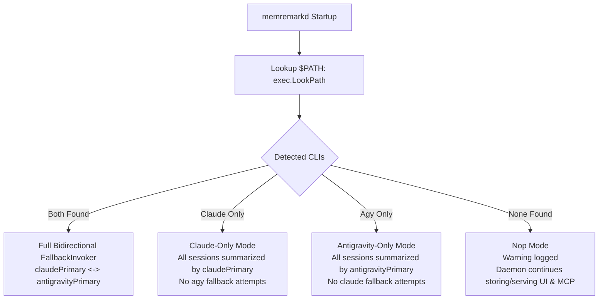

# MemRemark Design Specification: Single-CLI Standalone & Environment Robustness

- **Date:** 2026-08-19
- **Status:** Approved
- **Scope:** Daemon Startup Discovery, Single-CLI Standalone Execution, Invoker Routing Matrix, and Future Extensibility

---

## 1. Overview & Problem Statement

MemRemark is designed to bridge working memory across AI coding assistants (**Claude Code** and **Antigravity CLI**).

In real-world developer environments:
1. A developer may only use **Claude Code** (no `agy` installed).
2. A developer may only use **Antigravity CLI** (no `claude` installed).
3. A fresh install may start before either assistant has created any transcript directories or databases.

Prior to this design, `FallbackInvoker` assumed both CLI executables might be present, leading to blind subprocess invocations (`exec: "agy": executable file not found in $PATH` or `exec: "claude": executable file not found in $PATH`) and log pollution when only one CLI was installed.

This specification defines the **Startup Capability Discovery** architecture, ensuring MemRemark operates cleanly, robustly, and with zero-overhead in Single-CLI, Multi-CLI, and No-CLI environments.

---

## 2. Goals & Non-Goals

### Goals
- **Zero-Friction Single-CLI Operation:** MemRemark runs seamlessly if only `claude` OR only `agy` is present in `$PATH`.
- **Clean Logs & Zero Subprocess Errors:** Eliminate blind fallback attempts to non-existent executables.
- **Tolerant I/O:** Missing transcript folders (`~/.claude/projects` or `~/.gemini/.../conversation_summaries.db`) are treated as normal "no-op" states without errors or crash loops.
- **Future Extensibility:** Provide a clean foundation for adding new LLM backends (`ollama`, `copilot`, etc.) or IDE adapters (`Cursor`, `Zed`, etc.) without modifying core database or debounce logic.

### Non-Goals
- No automatic downloading or installation of external CLI tools.
- No changes to the underlying SQLite database schema.
- No complex background polling of `$PATH` changes (YAGNI; daemon restart via `systemctl --user restart memremarkd` or `./install.sh` suffices if new CLI is installed).

---

## 3. Architecture & Discovery Logic



### 3.1 Startup Capability Discovery (`resolveInvokers`)

In `cmd/memremarkd/main.go`, invoker resolution is handled by a dedicated helper:

```go
type InvokerSetup struct {
    ClaudeInvoker      summarizer.Invoker
    AntigravityInvoker summarizer.Invoker
    Summary            string
}

func resolveInvokers(cfg config.Config, lookPath func(string) (string, error)) InvokerSetup
```

### 3.2 Routing Matrix

| Environment State | `claudeInvoker` | `antigravityInvoker` | Log Output |
| :--- | :--- | :--- | :--- |
| **Both `claude` & `agy`** | `FallbackInvoker{Primary: claude, Fallback: agy}` | `FallbackInvoker{Primary: agy, Fallback: claude}` | `memremarkd: active invokers: claude (primary/fallback) + agy (primary/fallback)` |
| **Only `claude`** | `claudePrimary` | `claudePrimary` | `memremarkd: active invokers: claude only (agy not found in PATH)` |
| **Only `agy`** | `antigravityPrimary` | `antigravityPrimary` | `memremarkd: active invokers: agy only (claude not found in PATH)` |
| **Neither CLI** | `NopInvoker{}` | `NopInvoker{}` | `memremarkd: warning: no supported CLI found in PATH; summarization disabled` |

*Note: In Single-CLI mode, if transcripts from the other CLI exist (e.g. from prior historical usage or imported files), the active CLI is used to summarize them rather than failing.*

---

## 4. Component Robustness & Tolerant I/O

### 4.1 Claude Code Adapter (`internal/adapter/claudecode`)
- `DiscoverTranscriptFiles(root)` traverses `$HOME/.claude/projects`.
- If `root` does not exist on disk, `filepath.WalkDir` returns `nil, nil`. No warning is emitted; transcripts are reported as empty.

### 4.2 Antigravity CLI Adapter (`internal/adapter/antigravity`)
- `pollAntigravity` inspects `$HOME/.gemini/antigravity-cli/conversation_summaries.db`.
- If file is missing (`os.IsNotExist(err)`), the poller immediately returns `nil` without logging an error.

### 4.3 Hooks (`cmd/memremark-hook-claude`, `cmd/memremark-hook-agy`)
- Both hook binaries query SQLite (`~/.memremark/memremark.db`) via `internal/hookctx`.
- They do not execute external CLI subprocesses and have zero cross-dependencies on other CLI tools.

### 4.4 MCP Server & Web UI
- `memremark-mcp` and `memremark-ui` interface strictly with the SQLite storage layer and operate 100% agnostically of CLI availability.

---

## 5. Extensibility Framework (Open-Closed Principle)

To support future assistant adapters and LLM summarizers:

1. **New LLM Backends (e.g., `OllamaInvoker`, `CopilotInvoker`):**
   - Implement `summarizer.Invoker`:
     ```go
     type Invoker interface {
         Invoke(ctx context.Context, prompt string) (string, error)
     }
     ```
   - Register the backend in `resolveInvokers` priority chain.

2. **New Assistant Adapters (e.g., `Cursor`, `Zed`, `Windsurf`):**
   - Add new package under `internal/adapter/<name>`.
   - Implement transcript parser returning `[]observation.Observation`.
   - Register poll loop in `internal/daemon/daemon.go`.

---

## 6. Edge Cases & Error Handling

1. **`NopInvoker` Execution:**
   - Returns a structured error: `fmt.Errorf("summarizer: no active LLM CLI available in PATH")`.
   - Daemon debounce tracker retains unsummarized items due for retry when an invoker becomes available, without wedging memory.

2. **New CLI Installed After Daemon Start:**
   - User re-runs `./install.sh` or restarts systemd unit (`systemctl --user restart memremarkd`).
   - Startup discovery runs freshly and attaches the new CLI.

3. **Temporary CLI Failure vs Binary Missing:**
   - Binary missing: Detected upfront at startup -> omitted from fallback chain.
   - Runtime error (rate limit, network timeout, auth expired): Handled at runtime -> delegates to fallback invoker if configured, or retries next poll tick.

---

## 7. Testing Strategy

1. **Unit Tests (`cmd/memremarkd/main_test.go` or `internal/daemon/`):**
   - Parameterized test for `resolveInvokers` covering all 4 states in the routing matrix using mock `lookPath`.
2. **Daemon Unit Tests (`internal/daemon/daemon_test.go`):**
   - Verify `PollOnce` executes cleanly when one or both transcript directories/DBs do not exist on filesystem.
3. **End-to-End Build & Race Detection:**
   - `go test -v -race ./...`
   - `make build`

---

## 8. Decision Log

| Decision | Alternatives Considered | Rationale |
| :--- | :--- | :--- |
| **Startup Capability Discovery** | 1. Startup `LookPath` (Chosen)<br>2. Dynamic TTL cache<br>3. Config-file toggle | Minimal code complexity, zero runtime CPU overhead, matches Unix daemon idioms. |
| **Single-CLI Cross Summarization** | 1. Use available CLI for all transcripts (Chosen)<br>2. Drop transcripts of missing CLI | Maximizes knowledge retention even if developer switches or experiments with assistants. |
| **NopInvoker on Zero CLIs** | 1. Return structured error without crash (Chosen)<br>2. Fatal exit on startup | Allows MemRemark UI and MCP to function for browsing existing memory even in headless non-LLM environments. |
